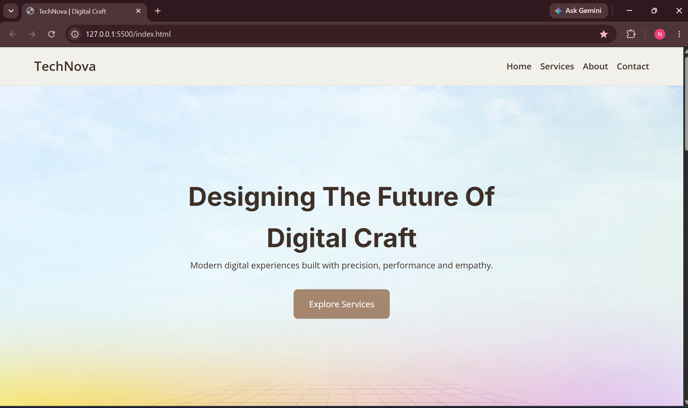
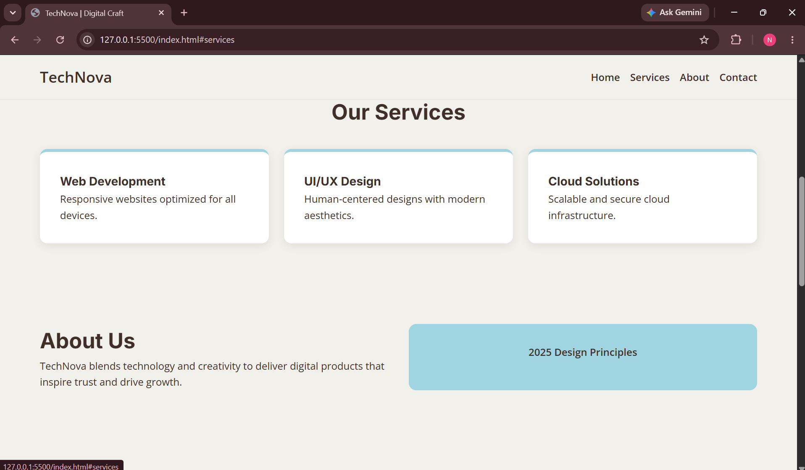
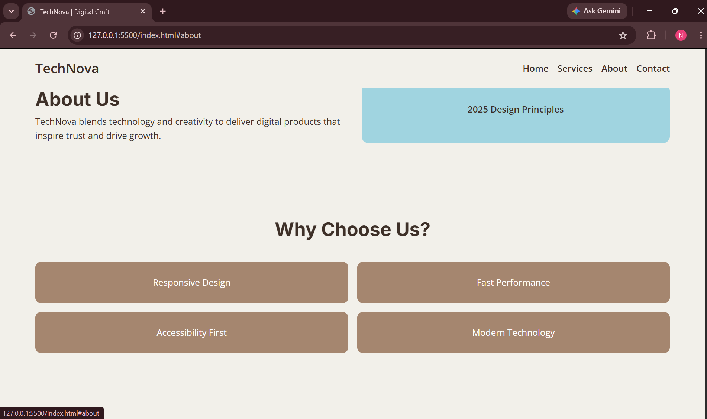
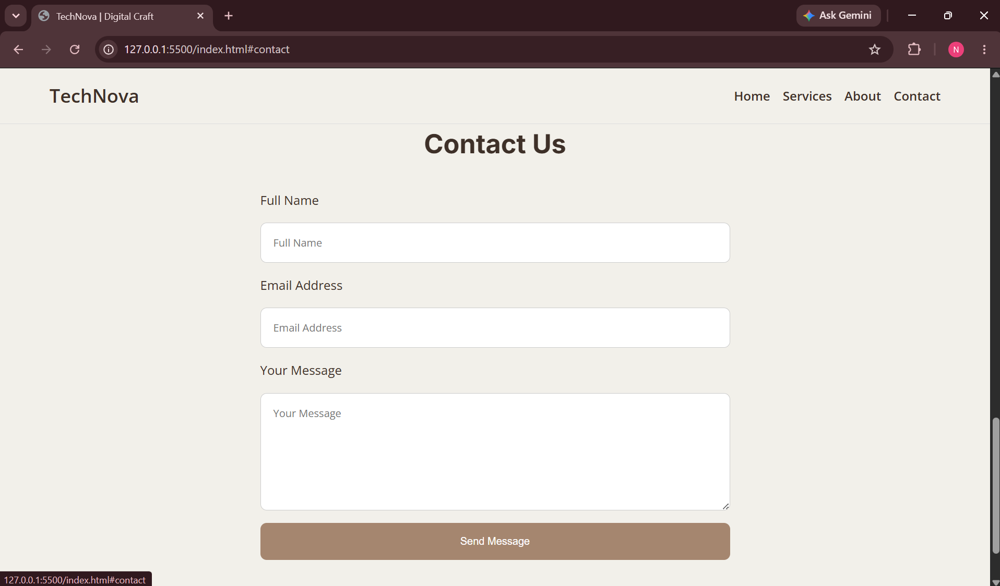

# TechNova | Digital Craft

## 🚀 Overview
TechNova is a responsive landing page built with **HTML, CSS, and JavaScript**.  
It showcases services, values, and a contact form in a clean, modern, and mobile‑friendly design.  
This project was developed as part of **DecodeLabs Internship Project 1**.

## ✨ Features
- Responsive design (mobile, tablet, desktop)
- Sticky navigation bar with hamburger menu
- Hero section with background image
- Services grid with cards
- About section with design principles
- Why Us section highlighting values
- Contact form with accessibility labels
- Modern color palette (Mocha, Blue, Grey, Dark, White)

## 🛠️ Tech Stack
- HTML5
- CSS3 (Flexbox, Grid, Media Queries)
- JavaScript (ES6 for interactivity)

## 📂 Project Structure
PROJECT1/
│── index.html          # Main HTML file
│── style.css           # Stylesheet for layout and design
│── script.js           # JavaScript for interactivity (menu toggle)
│── background.png      # Background image for hero section
│── /images             # Screenshots and assets
│── README.md           # Project documentation


## ⚙️ Setup Instructions
1. Clone the repository:
   ```bash
   git clone https://github.com/neha5x3/Task-1-NallaNeha.git
2.Navigate to the project folder:
    cd Task-1-NallaNeha
3. Open index.html in your browser
   OR run it using VS Code Live Server.
   
## 📸 Screenshots

### 1. Homepage


### 2. Services Section


### 3. About Section


### 4. Contact Form



## Testing Section
✅ Testing
Verified responsiveness on mobile, tablet, and desktop
Tested on Chrome, Firefox, and Edge
No console errors during interaction

📜 License
MIT License

👨‍💻 Author
Name: Nalla Neha
Education: B.Tech CSE (DecodeLabs Internship Project 1)
GitHub: https://github.com/neha5x3  